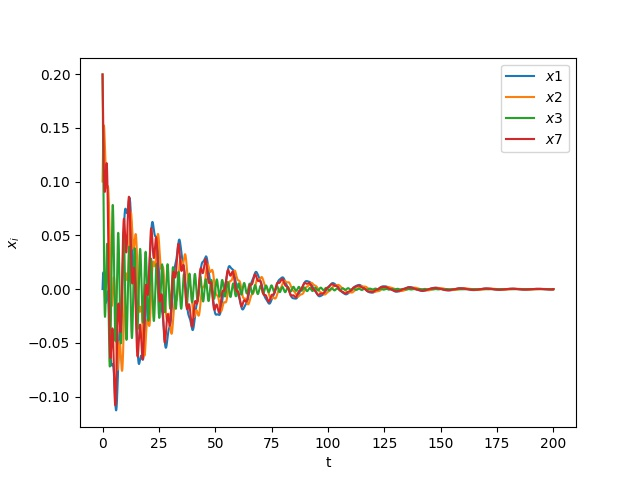
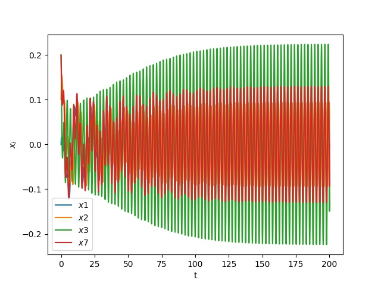
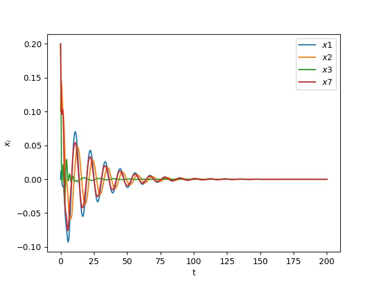

# Numerical simulation Bidirectional Super-Ring-Shaped Neural Network With n Neurons and Multiple Delays

## Contents

- [Introduction](Introduce_to_project)

- [Project structure](Organize_source)

- [Install](How_to_install_and_setup_environments)

- [How to run](How_to_run)

- [Demo](Show_some_exmample)

- [Contact](Contact_to_author)


## Introduction

```
This responsibility to implement from scratch by python is to process the Numerical simulation of Bidirectional Super-Ring-Shaped Neural Network With n Neurons and Multiple Delays
```

Link paper: [Dynamics Analysis and Design for a Bidirectional
Super-Ring-Shaped Neural Network With n
Neurons and Multiple Delays](https://ieeexplore.ieee.org/document/9152172).

## Project structure

```
config              # Config params of numerical simulation
    parms.yml
outputs             # Save result figures
main.py             # main source
readme.md
requirements.txt    # require libraries   

```

## Install

This project run on `python3`, you have to install some require libraries by running follow command

```
pip install -r requirements.txt
```

## How to run

### Step 1

Before running, you need to setup params at `configs/parms.yaml` 
```
Global:
  output_dir: "outputs"  # Save picture of the numerical simulation 

Params:
  num_node:     # Number node of modes
  time_step:    # Time step, this values is presented continuous of times, which is lower the better
  init_values:  # The initial value of model
  r_signal:     # ratio of the capacitance to the resistance
  b_forward:    # connection weights follow clockwise
  b_backward:   # connection weights follow counterclockwise
  T1_delay:     # time delays follow clockwise
  T2_delay:     # time delays follow counterclockwise

```


### Step 2
run 
```
python3 -m main configs/parms.yaml
```

## Demo

### Example 1
```
Global:
  output_dir: "outputs"

Params:
  num_node: 7
  time_step: 0.001
  init_values: [0, 0.1, 0.2, 0.1, 0, 0.1, 0.2]
  r_signal: 0.35
  b_forward: [0.5, -0.8, 1, -1.25, 2.5, -1, 0.8]
  b_backward: [0.5, 0.8, -1, 2.5, -1.25, 1, -0.8]
  T1_delay: [0.03, 0.035, 0.04, 0.045, 0.05, 0.055, 0.06]
  T2_delay: [0.03, 0.035, 0.04, 0.045, 0.05, 0.055, 0.06]
```
<p align="left">

</p>


### Example 2
```
Global:
  output_dir: "outputs"

Params:
  num_node: 7
  time_step: 0.001
  init_values: [0, 0.1, 0.2, 0.1, 0, 0.1, 0.2]
  r_signal: 0.35
  b_forward: [0.5, -0.8, 1, -1.25, 2.5, -1, 0.8]
  b_backward: [0.5, 0.8, -1, 2.5, -1.25, 1, -0.8]
  T1_delay: [0.04, 0.045, 0.05, 0.055, 0.06, 0.065, 0.07]
  T2_delay: [0.04, 0.045, 0.05, 0.055, 0.06, 0.065, 0.07]
```
<p align="left">

</p>

### Example 3
```
Global:
  output_dir: "outputs"

Params:
  num_node: 7
  time_step: 0.001
  init_values: [0, 0.1, 0.2, 0.1, 0, 0.1, 0.2]
  r_signal: 0.35
  b_forward: [0.5, -0.8, 1, -1.25, 2.5, -1, 0.8]
  b_backward: [0.5, 0.8, -1, 2.5, -1.25, 1, -0.8]
  T1_delay: 
  T2_delay: 
```
<p align="left">

</p>

### Example 4
```
Global:
  output_dir: "outputs"

Params:
  num_node: 7
  time_step: 0.001
  init_values: [0, 0.1, 0.2, 0.1, 0, 0.1, 0.2]
  r_signal: 0.25
  b_forward: [0.5, -0.8, 1, -1.25, 2.5, -1, 0.8]
  b_backward: [0.5, 0.8, -1, 2.5, -1.25, 1, -0.8]
  T1_delay: 
  T2_delay: 
```
<p align="left">

</p>


## Contact

- [Nguyen Y Hop](nguyenyhop1999@gmail.com)
